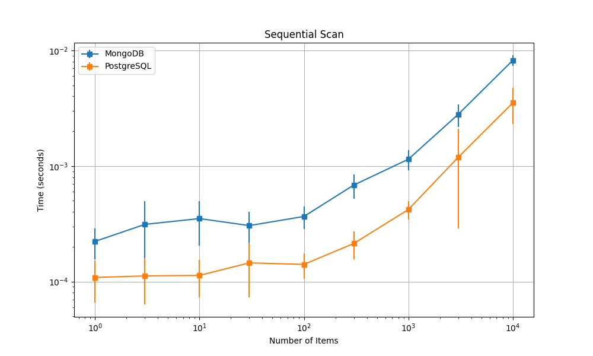
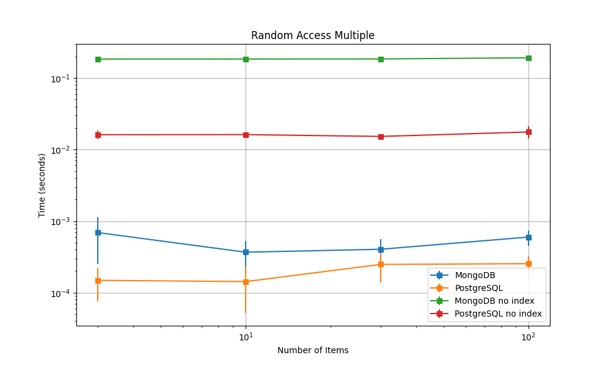
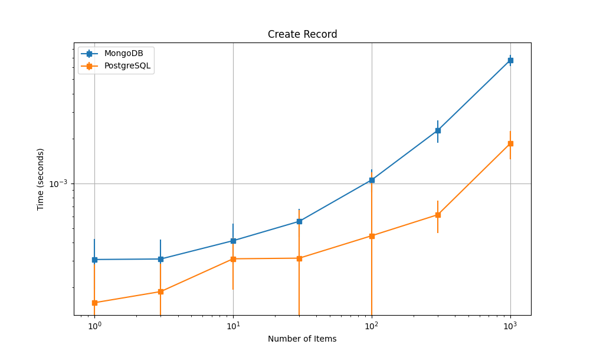
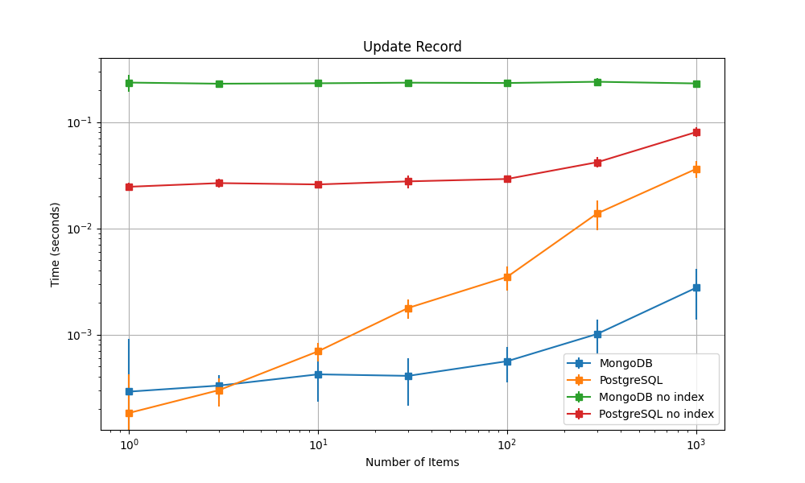
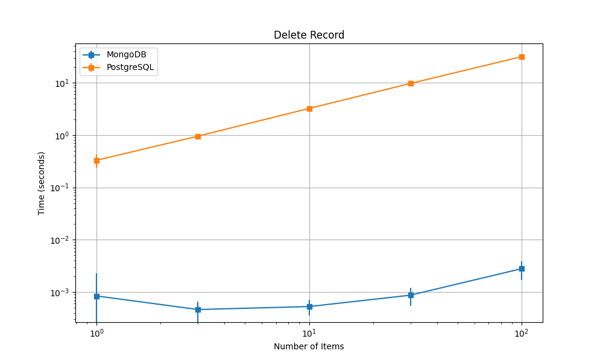

# MongoDB vs PostgreSQL Performance Comparison

The following results are obtained from a machine with the following configuration:

- CPU: Intel(R) Core(TM) i5-13600K CPU @ 3.90GHz
- RAM: 64GB DDR4 1064.1MHz
- SSD: Predator GM7 M.2 2TB

MongoDB and PostgreSQL are both running in Docker containers in WSL 2, where the command to start the containers is:

```bash
docker run -d --name mongodb -p 27017:27017 mongo # MongoDB
docker run -d --name postgresql -p 5432:5432 -e POSTGRES_PASSWORD=password postgres # PostgreSQL
```

## Sequential Scan

We first tested the performance of MongoDB and PostgreSQL when performing a sequential scan.

The equivalent SQL query is `SELECT product_id, amazon_id FROM products LIMIT {num}`. We tested the performance for different sizes of `num`.

The results are shown below. We can see that PostgreSQL is consistently faster than MongoDB by an order of magnitude across all sizes.



## Random Access Multiple

We then tested the performance of MongoDB and PostgreSQL when performing random access to multiple products. We also tested the performance when the `product_id` is not indexed.

The equivalent SQL query is `SELECT product_id, amazon_id FROM products WHERE product_id IN ({product_ids})`. We tested the performance for different sizes of `product_ids`.

The results are shown below. We can see that PostgreSQL is consistently faster than MongoDB by an order of magnitude across all sizes and both with and without the index. The performance with index is dramatically better than without the index. The time taken without the index keeps the same across different sizes since the query requires a complete scan of the table.



## One-to-many Retrieval

We then tested the performance of MongoDB and PostgreSQL when performing one-to-many retrieval. We retrieved the ratings for a given product.

The equivalent SQL query is `SELECT * FROM ratings WHERE product_id = {product_id}`. For MongoDB, since the ratings are embedded in the `products` collection, we just need to query the given product and extract the ratings.

The time taken for MongoDB to perform the retrieval is 0.000368s ± 0.000666s, while the time taken for PostgreSQL is 0.127142s ± 0.061859s. It shows that the embedded approach in MongoDB is much faster than the relational approach in PostgreSQL for such one-to-many retrieval.

## Many-to-many Join

We then tested the performance of MongoDB and PostgreSQL when performing many-to-many join. For MongoDB, we used its aggregation pipeline with the `$lookup` phase to retrieve the categories based on the `categories` field in the `products` collection. For PostgreSQL, we used JOIN operations with the `product_categories` and `categories` tables.

The time taken for MongoDB to perform the retrieval is 0.000441s ± 0.000528s, while the time taken for PostgreSQL is 0.000233s ± 0.000091s. It shows that the JOIN operation in PostgreSQL is faster than the `$lookup` phase in MongoDB.

## Create Records

We then tested the performance of MongoDB and PostgreSQL when creating records.

The equivalent SQL query is `INSERT INTO products (product_id, name, amazon_id) VALUES ({product_id}, {name}, {amazon_id})`.

The results show that PostgreSQL is faster than MongoDB consistently.



## Update Records

We then tested the performance of MongoDB and PostgreSQL when updating records with and without the index.

The equivalent SQL query is `UPDATE products SET name = {name} WHERE product_id = {product_id}`.

The results show that although PostgreSQL is faster than MongoDB in small sizes slightly, while MongoDB is much faster than PostgreSQL when the size is large.



## Delete Records

We then tested the performance of MongoDB and PostgreSQL when deleting records.

The equivalent SQL query is `DELETE FROM products WHERE product_id BETWEEN {start} AND {end}`.

The results show that PostgreSQL is slower than MongoDB by several orders of magnitude. This might be due to the fact that the embedded approach in MongoDB is more efficient than the relational approach in PostgreSQL for such deletion, since PostgreSQL needs to do several cascade operations to delete the records in the `ratings` table and ensure the consistency of the database.



## Vector Search (on PostgreSQL)
To test the natural language search performance, we tested PostgreSQL's performance when performing vector search using the `pgvector` extension (<https://github.com/pgvector/pgvector>), which is the most popular and battle-tested extension for vector search in PostgreSQL.

We used the `pgvector` extension to create a vector index on the `doc_embedding` column in the `ratings` table.

We conducted two types of vector search: 

- Searching for one vector in a given range: `SELECT * FROM ratings WHERE doc_embedding <=> '[1,2,3] > 0.5 LIMIT 1`
- Searching for the nearest vector: `SELECT * FROM ratings ORDER BY doc_embedding <-> '[1,2,3]' LIMIT 1`

With two different index types:

- IVFFlat: 倒排文件索引。将向量空间划分为多个簇，每个簇都有一个中心点。在搜索时，系统会首先找到最接近查询向量的簇，然后仅在该簇内进行搜索。构建更快，使用内存更少，但查询速度较慢，且精度较低。
- HNSW: 分层导航小世界图（Hierarchical Navigable Small World），是一种基于图的索引结构。通过构建多层图结构，将向量表示为图中的节点，并在不同层次间维护连接。搜索过程从较高层开始，逐层向下导航到目标层，从而大幅提高搜索速度。构建更慢，使用内存更多，但查询速度更快，且精度较高。

| **索引类型**       | **任务**                        | **平均时间 (mean)** | **标准差 (std)**   | **备注**                                   |
|--------------------|--------------------------------|---------------------|--------------------|------------------------------------------|
| 不加任何索引       | Searching for one vector in given range | 0.050670s           | 0.003632s          | 无索引                                   |
|                    | Searching for the nearest vector       | 92.953029s          | 13.785445s         | 无索引                                   |
| **加入 IVFFlat**   | Searching for one vector in given range | 0.052054s           | 0.008693s          | 构建更快，使用内存更少，但查询速度较慢    |
|                    | Searching for the nearest vector       | 0.273401s           | 0.171082s          | 构建更快，使用内存更少，但查询速度较慢    |
| **加入 HNSW**      | Searching for one vector in given range | 0.056273s           | 0.011216s          | 构建更慢，使用内存更多，但查询速度更快    |
|                    | Searching for the nearest vector       | 0.231462s           | 0.002510s          | 构建更慢，使用内存更多，但查询速度更快    |
